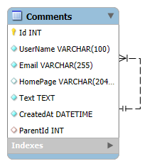

# 💬 SPA Comments App

[](https://dotnet.microsoft.com/)
[](https://angular.dev/)
[](https://www.sqlite.org/)
[](https://dotnet.microsoft.com/apps/aspnet/signalr)
[](https://www.docker.com/)

Full-stack Single Page Application (SPA) for nested comments with file attachments, CAPTCHA, and real-time updates.

## 🌐 Live Demo

> **[http://khalin-comments.germanywestcentral.cloudapp.azure.com](http://khalin-comments.germanywestcentral.cloudapp.azure.com)**

## 🎥 Demo Video

[▶ Watch demo video](https://youtu.be/njRias2-9ig)

## 🛠 Tech Stack

### Backend
- **ASP.NET Core 10** (Web API)
- **Entity Framework Core** (Code First, SQLite)
- **MediatR** (CQRS pattern)
- **FluentValidation** (request validation)
- **SignalR** (real-time WebSocket notifications)
- **Redis** (CAPTCHA session caching)
- **ImageSharp** (image resize, CAPTCHA generation)
- **HtmlSanitizer** (XSS protection)

### Frontend
- **Angular 21** (standalone components)
- **RxJS** (reactive data flow)
- **SignalR client** (real-time updates)

### Infrastructure
- **Docker & Docker Compose** (full containerization)
- **Nginx** (reverse proxy for frontend)
- **SQLite** (lightweight embedded database)
- **Redis 7** (cache)

> **Note on database choice:** The project uses SQLite instead of MS SQL Server for deployment simplicity. The application architecture (Clean Architecture, EF Core, Repository pattern) is fully database-agnostic — switching to MS SQL Server requires only changing the EF Core provider and connection string, with zero changes to business logic or API layer.

## ✨ Features
- 🧵 **Nested threaded comments** (cascade layout)
- 🗂 **Sortable table** (UserName, Email, Date) — LIFO by default
- 📄 **Pagination** (25 comments per page)
- 🛡️ **CAPTCHA protection** against spam
- 🔒 **Security**: 
  - XSS protection (HTML sanitizer — allowed tags: `<a>`, `<code>`, `<i>`, `<strong>`)
  - SQL injection protection via EF Core parameterized queries
- 🖼️ **Image upload** with auto-resize to max 320×240 pixels
- 📁 **TXT file upload** (max size: 100KB)
- 🔍 **Lightbox** for image preview
- ⚡ **Real-time updates** via WebSocket (SignalR)

## 📐 Architecture

```
┌─────────┐     ┌──────────┐     ┌──────────┐     ┌────────┐
│ Angular │────▶│  Nginx   │────▶│ ASP.NET  │────▶│ SQLite │
│   SPA   │     │ (proxy)  │     │ Core API │     └────────┘
└─────────┘     └──────────┘     │          │────▶┌────────┐
                                 │ SignalR  │     │ Redis  │
                                 └──────────┘     └────────┘
```

## 🚀 Quick Start (Docker)

```bash
git clone https://github.com/AndriiKhalin/CommentApp.git
cd CommentApp
docker compose up -d
```

Open **http://localhost** in your browser.

### Services

| Service  | URL                    | Description        |
|----------|------------------------|--------------------|
| Frontend | http://localhost       | Angular SPA        |
| API      | http://localhost/api   | REST API via Nginx |
| Backend  | http://localhost:5000  | Direct API access  |
| Redis    | localhost:6379         | Cache              |

### Stop

```bash
docker compose down        # stop containers
docker compose down -v     # stop + remove data volumes
```

## 🗄 Database Schema

See [`db-schema.sql`](./db-schema.sql) script for the full SQLite schema.

See [`db-schema.mwb`](./db-schema.mwb) file created in MySQL Workbench for the full SQLite schema.

### ER Diagram



> *Diagram created in MySQL Workbench for visualization purposes. The actual database uses SQLite with an equivalent schema.*

### Table: Comments

| Column         | Type    | Constraints                          |
|----------------|---------|--------------------------------------|
| Id             | INTEGER | PK, AUTOINCREMENT                    |
| UserName       | TEXT    | NOT NULL                             |
| Email          | TEXT    | NOT NULL                             |
| HomePage       | TEXT    | NULL                                 |
| Text           | TEXT    | NOT NULL                             |
| AttachmentPath | TEXT    | NULL                                 |
| AttachmentType | INTEGER | NULL (0 = Image, 1 = Text)           |
| CreatedAt      | TEXT    | NOT NULL, DEFAULT datetime('now')    |
| ParentId       | INTEGER | NULL, FK → Comments(Id), self-ref    |

## 📁 Project Structure

```
SpaComments/
├── backend/
│   ├── CommentsApp.API/            # Controllers, Hubs, Middleware
│   ├── CommentsApp.Application/    # CQRS, DTOs, Services, Validators
│   ├── CommentsApp.Domain/         # Entities, Interfaces
│   ├── CommentsApp.Infrastructure/ # EF Core, Redis, Repositories
│   └── Dockerfile
├── frontend/
│   ├── src/app/
│   │   ├── core/                   # Models, Services
│   │   └── features/comments/      # Form, List, Item components
│   ├── nginx.conf
│   └── Dockerfile
├── docker-compose.yml
├── db-schema.sql                   # SQLite schema
├── docs/
│   └── er-diagram.png              # ER diagram (MySQL Workbench export)
└── README.md
```

## 🔧 Local Development (without Docker)

### Backend
```bash
cd backend
dotnet restore
dotnet run --project CommentsApp.API
```
Requires: .NET 10 SDK, Redis running locally.

### Frontend
```bash
cd frontend
npm install
npm start
```
Opens at http://localhost:4200 with proxy to backend.

## 🔄 Switching to MS SQL Server

If you need to use MS SQL Server instead of SQLite:

1. Replace NuGet package:
   ```bash
   dotnet remove package Microsoft.EntityFrameworkCore.Sqlite
   dotnet add package Microsoft.EntityFrameworkCore.SqlServer
   ```
2. Change `Program.cs`: `UseSqlite(...)` → `UseSqlServer(...)`
3. Update connection string in `appsettings.json`
4. Regenerate migrations: `dotnet ef migrations add InitialCreate`

No changes needed in controllers, services, or frontend.
